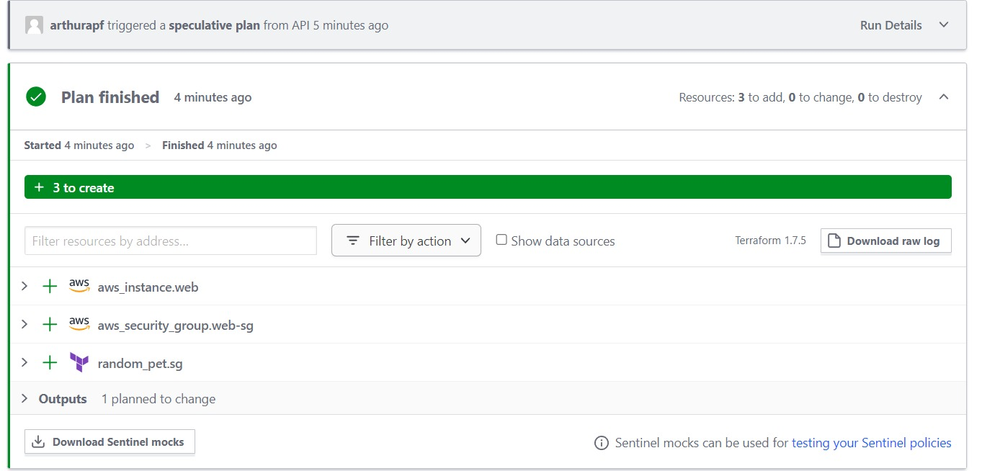
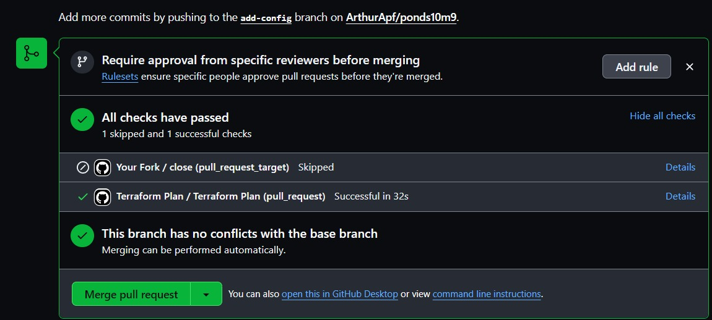

# Prints com a pipeline funcional:

# Conhecimentos:
Dentre os conceitos aprendidos, os que valem destacar são sem duvida todo o conceito de configuração do Terraform, como definir variaveis, como gerar tokens, como configurar esses tokens no github, etc.